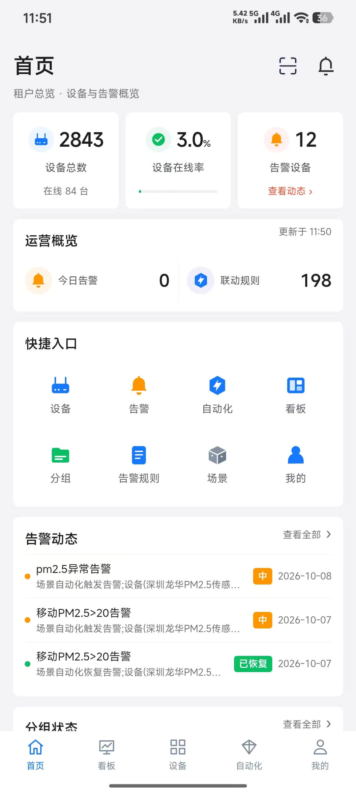
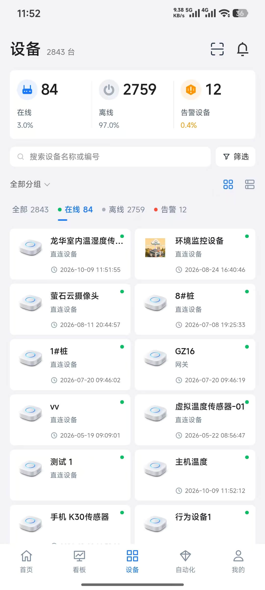
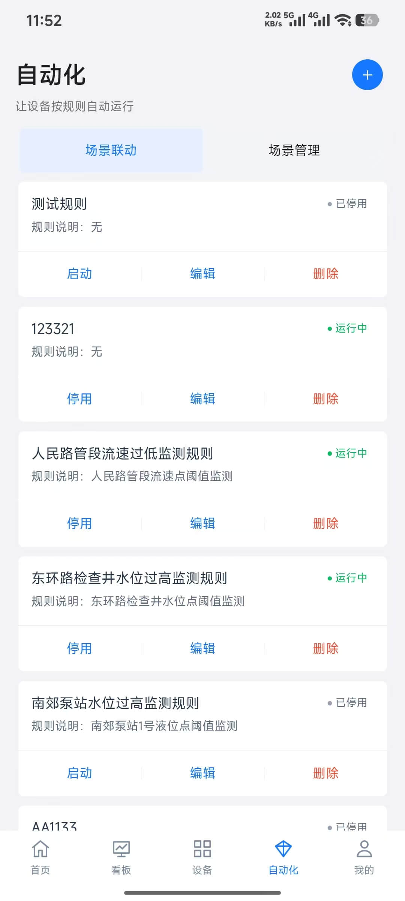
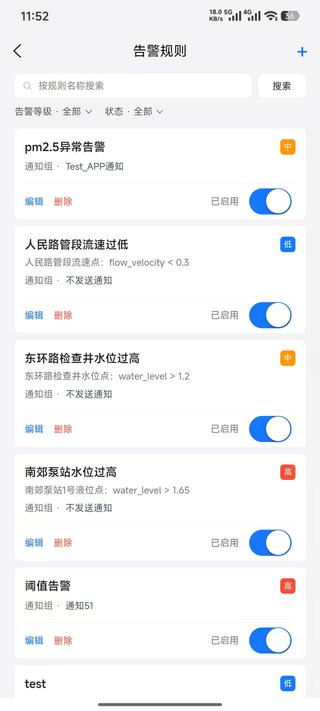
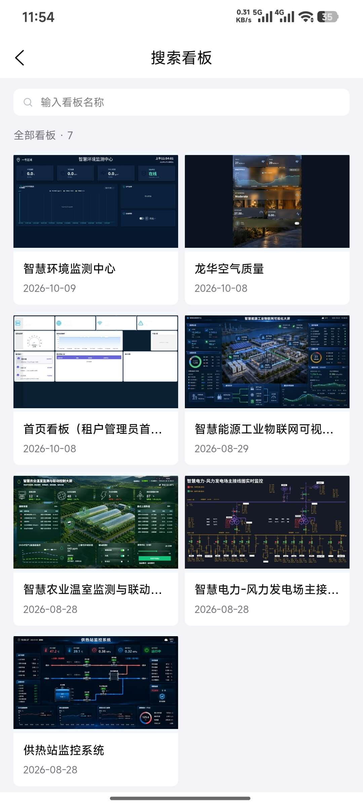

# ThingsPanel-App

## 功能特点

- **设备管理**：查看和搜索设备，支持扫码添加已在平台导入的设备。
- **实时监测**：查看设备在线状态、遥测数据和历史数据。
- **设备控制**：支持手动控制设备，以及通过自动化规则执行控制动作。
- **自动化规则**：配置设备条件或时间条件触发的自动化规则。
- **告警管理**：查看告警列表和详情，配置告警规则，接收告警推送。
- **可视化看板**：浏览平台看板，支持 ThingsVis 设备可视化与大屏预览。
- **账号设置**：支持个人资料编辑、密码修改和服务地址配置。
- **多语言支持**：提供中文和英文界面。
- **跨平台开发**：基于 Vue 3 和 uni-app，可面向 Android、iOS、小程序及 H5 构建，具体功能以各平台适配情况为准。

## 演示

- 安卓 [中文官网（扫码下载）](http://thingspanel.cn) 
- 苹果iOS请到Appstore 搜索 ThingsPanel

## 截图

ThingsPanel App 2.0.1 界面预览，依次展示首页、设备、自动化规则、告警规则和可视化看板。

<table>
  <tr>
    <th align="center">首页</th>
    <th align="center">设备</th>
  </tr>
  <tr>
    <td align="center"></td>
    <td align="center"></td>
  </tr>
  <tr>
    <th align="center">自动化规则</th>
    <th align="center">告警规则</th>
  </tr>
  <tr>
    <td align="center"></td>
    <td align="center"></td>
  </tr>
  <tr>
    <th colspan="2" align="center">可视化看板</th>
  </tr>
  <tr>
    <td colspan="2" align="center"></td>
  </tr>
</table>
